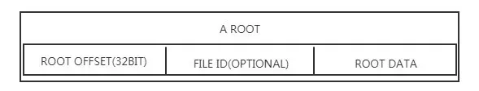

# 1. 简介
FlatBuffers 是一个开源的、跨平台的、高效的、提供了多种语言接口的序列化工具库。实现了与 Protocal Buffers 类似的序列化格式。主要由 Wouter van Oortmerssen 编写，并由 Google 开源。Oortmerssen 最初为 Android 游戏和注重性能的应用而开发了 FlatBuffers，现在它具有 C ++、C＃、C、Go、Java、PHP、Python 和 JavaScript 的接口。

# 2. FlatBuffers Scheme
FlatBuffers 通过 Scheme 文件定义数据结构，Schema 定义与其他框架使用的IDL(Interface description language)语言类似简单易懂，FlatBuffers 的 Scheme 是一种类 C 的语言（尽管 FlatBuffers 有自己的接口定义语言 Scheme 来定义要与之序列化的数据，但它也支持 Protocol Buffers 中的 .proto 格式）。下面以官方 Tutorial 中的 monster.fbs 为例进行说明：

```C
// Example IDL file for our monster's schema.
namespace MyGame.Sample;
enum Color:byte { Red = 0, Green, Blue = 2 }
union Equipment { Weapon } // Optionally add more tables.
struct Vec3 {
  x:float;
  y:float;
  z:float;
}
table Monster {
  pos:Vec3;
  mana:short = 150;
  hp:short = 100;
  name:string;
  friendly:bool = false (deprecated);
  inventory:[ubyte];
  color:Color = Blue;
  weapons:[Weapon];
  equipped:Equipment;
  path:[Vec3];
}
table Weapon {
  name:string;
  damage:short;
}
root_type Monster;
```

namespace MyGame.Sample;

namespace 定义命名空间，可以定义嵌套的命名空间，用 . 分割。

enum Color:byte { Red = 0, Green, Blue = 2 };

enum 定义枚举类型。和常规的枚举类稍有不同的地方是可以定义类型。比如这里的 Color 是 byte 类型。enum 字段只能新增，不能废弃。

union Equipment {Weapon} // Optionally add more tables

union 类似 C/C++ 中的概念，一个 union 中可以放置多种类型，共同使用一个内存区域。这里的使用是互斥的，即这块内存区域只能由其中一种类型使用。相对 struct 来说比较节省内存。union 跟 enum 比较类似，但是 union 包含的是 table，enum 包含的是 scalar 或者 struct。union 也只能作为 table 的一部分，不能作 root type。

struct Vect3{ x : float; y : float; z : float;};

struct 所有字段都是必填的，因此没有默认值。字段也不能添加或者废弃，且只能包含标量或者其他 struct。struct 主要用于数据结构不会发生改变的场景，相对 table 使用更少的内存，lookup 的时候速度更快（struct 保存在父 table 中，不需要使用 vtable）。

table Monster{};

table 是在 FlatBuffers 中定义对象的主要方式，由一个名称（这里是 Monster）和一个字段列表组成。可以包含上面定义的所有类型。每个字段（Field）包括名称、类型和默认值三部分；每个字段都有默认值，如果没有明确写出则默认为 0 或者 null。每个字段都不是必须的，可以为每个对象选择要省略的字段，这是 FlatBuffers 向前和向后兼容的机制。

root_type Monster;

用于指定序列化后的数据的 root table。

Scheme 设计需要特别注意的：

新字段只能加在 table 的后面。旧代码会忽略这个字段，仍然可以正常执行。新代码读取旧的数据，会取到新增字段的默认值。
即使字段不再使用了也不能从 Scheme 中删除。可以标记为 deprecated，在生成代码的时候不会生成该字段的访问器。
如果需要嵌套的 vector，可以将 vector 包装在 table 中。string 对于其他编码可以使用 [byte] 或者 [ubyte] 支持。

